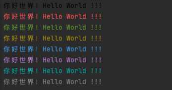
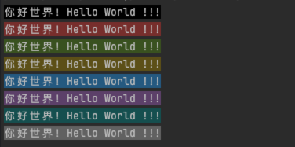
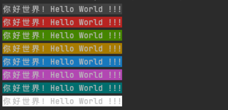
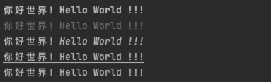
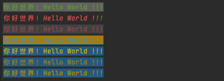

# macts


## 0x01 简介

macts 意为 MacOS Terminal Style

可以通过此模块，实现在mac系统终端上，美化程序文字输出

包括：

- 文字颜色：黑色(Black)、红色(Red)、绿色(Green)、黄色(Yellow)、蓝色(Blue)、品红色(Magenta)、青色(Cyan)、白色(White)
- 背景颜色：黑色、红色、绿色、黄色、蓝色、品红色、青色、白色以及对应高亮色(Bright)
- 文字样式：加粗(Blod)、淡化(Downplay)、倾斜(Italic)、下划线(Underline)、反转文字与背景颜色(Reverse)

## 0x02 用法

以下列举模块的几种用法：

### macts.FgColor:字体颜色

```go
	s := "你好世界！Hello World !!!"
	fmt.Println(macts.FgColor.Black(s))
	fmt.Println(macts.FgColor.Red(s))
	fmt.Println(macts.FgColor.Green(s))
	fmt.Println(macts.FgColor.Yellow(s))
	fmt.Println(macts.FgColor.Blue(s))
	fmt.Println(macts.FgColor.Magenta(s))
	fmt.Println(macts.FgColor.Cyan(s))
	fmt.Println(macts.FgColor.White(s))
```

执行结果：



### macts.BgColor:背景颜色

```go
	s := "你好世界！Hello World !!!"
	fmt.Println(macts.BgColor.Black(s))
	fmt.Println(macts.BgColor.Red(s))
	fmt.Println(macts.BgColor.Green(s))
	fmt.Println(macts.BgColor.Yellow(s))
	fmt.Println(macts.BgColor.Blue(s))
	fmt.Println(macts.BgColor.Magenta(s))
	fmt.Println(macts.BgColor.Cyan(s))
	fmt.Println(macts.BgColor.White(s))
```

执行结果：



### macts.BgColorBright:高亮背景颜色

```go
	s := "你好世界！Hello World !!!"
	fmt.Println(macts.BgColorBright.Black(s))
	fmt.Println(macts.BgColorBright.Red(s))
	fmt.Println(macts.BgColorBright.Green(s))
	fmt.Println(macts.BgColorBright.Yellow(s))
	fmt.Println(macts.BgColorBright.Blue(s))
	fmt.Println(macts.BgColorBright.Magenta(s))
	fmt.Println(macts.BgColorBright.Cyan(s))
	fmt.Println(macts.BgColorBright.White(s))
```

执行效果：



### macts.Style:字体样式

```go
	s := "你好世界！Hello World !!!"
	fmt.Println(macts.Style.Bold(s)) // 加粗
	fmt.Println(macts.Style.Downplay(s)) // 淡化
	fmt.Println(macts.Style.Italic(s)) // 倾斜
	fmt.Println(macts.Style.Underline(s)) // 下划线
	fmt.Println(macts.Style.Reverse(s)) // 反转
```

执行效果：



### macts.Render:自定义渲染

```go
	s := "你好世界！Hello World !!!"
	// 加粗 绿色字体 白色背景 无高亮
	fmt.Println(macts.Render(s, "Bold", "Green", "White", 0))
	// 倾斜 红色字体 无背景 无高亮
	fmt.Println(macts.Render(s, "Italic", "Red", "", 0))
	// 淡化 红色字体 黑色背景 高亮
	fmt.Println(macts.Render(s, "Downplay", "Red", "Black", 1))
	// 下划线 蓝色字体 黄色背景 高亮
	fmt.Println(macts.Render(s, "Underline", "Blue", "Yellow", 1))
	// 反转文字与背景颜色 蓝色字体 黄色背景 高亮
	fmt.Println(macts.Render(s, "Reverse", "Blue", "Yellow", 1))
	// 无样式 黄色字体 蓝色背景 无高亮
	fmt.Println(macts.Render(s, "", "Yellow", "Blue", 0))
	// 加粗 黄色字体 蓝色背景 无高亮
	fmt.Println(macts.Render(s, "Bold", "Yellow", "Blue", 0))
```

执行效果：



>  通过反转文字与背景颜色加上背景高亮，可以实现文字高亮效果，可以参考以上三种黄蓝配色

>  可自行编写函数保存不同的配色方案，实现快速使用

>  所有函数执行的返回值均为string类型的值，建议在字符串处理完毕后，在使用此函数赋予颜色

